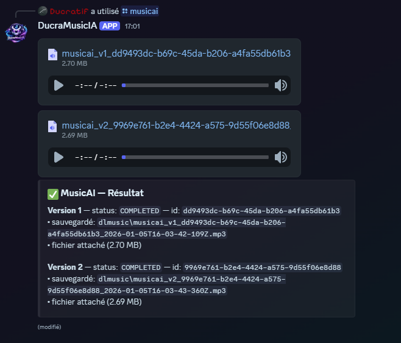
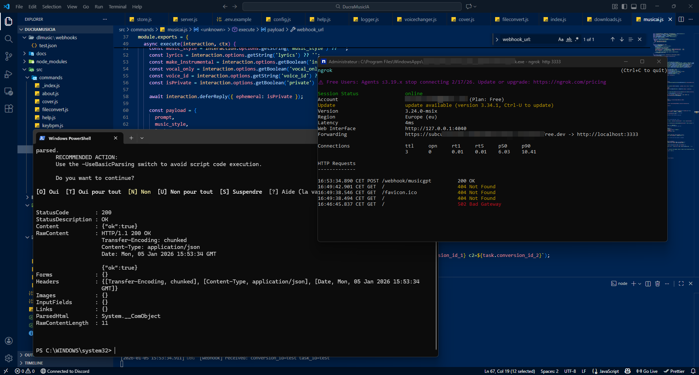
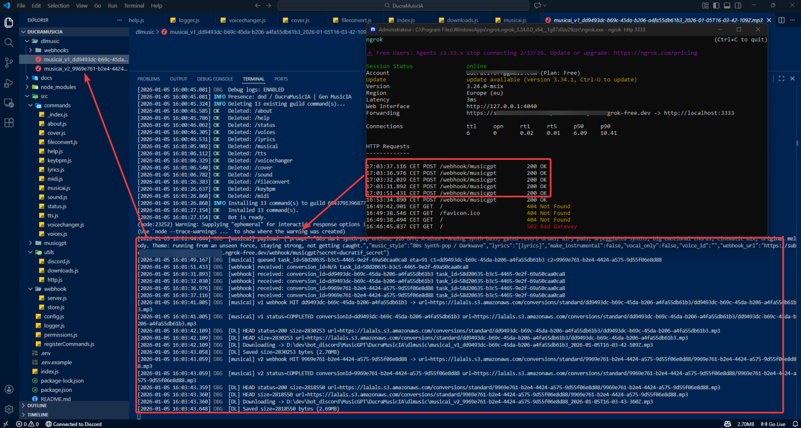
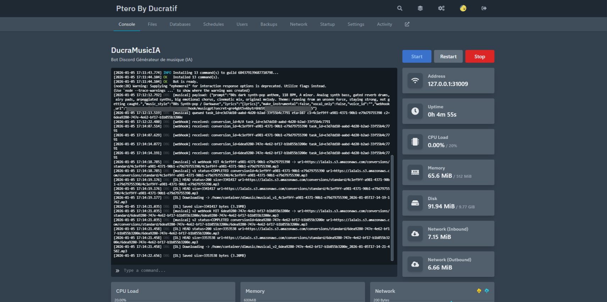
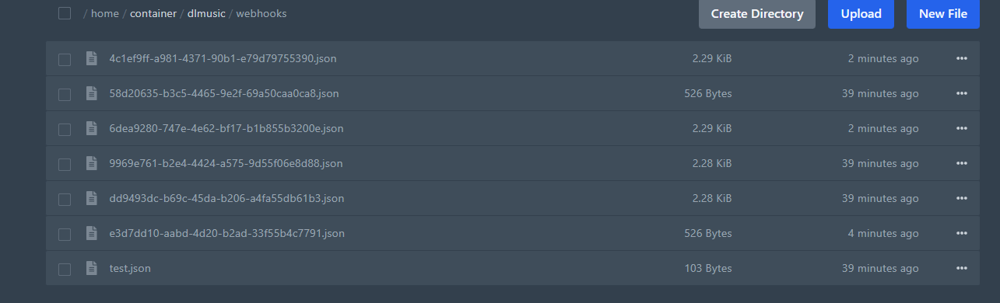
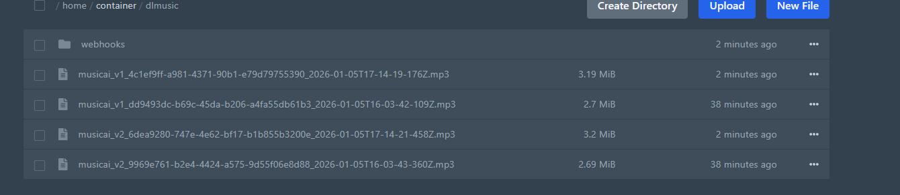

# 🎶 musicia — DucraMusicIA (MusicGPT)

Bot Discord **Node.js** qui génère de la musique via l’API **MusicGPT** (MusicAI + conversions), avec gestion propre du **timeout Discord**, logs détaillés, et support d’un mode **webhook** (Cloudflare Tunnel / ngrok) pour récupérer les résultats sans lien “bloqué”.

> Nom du bot : **DucraMusicIA**  
> Statut : **DND**  
> Présence : **DucraMusicIA | Gen MusicIA**  
> Développé par **Ducratif**

---

## 🚀 Ce que fait le bot

- Génère une musique via **/musicai** (MusicAI en 2 versions)
- Gère la génération sans timeout : `deferReply`, polling + webhook si activé
- Sauvegarde automatiquement les fichiers dans un dossier local (**dlmusic/**)
- Répond avec :
  - un fichier attaché si possible (selon la limite Discord)
  - sinon un lien (et/ou un backup côté serveur)
- Logs complets (INFO/DBG/ERR) pour tout diagnostiquer en prod (Pterodactyl inclus)
- Commandes **restreintes à un rôle** (ID configuré)

---

## 📁 Deux versions incluses

Ce repo contient **2 variantes prêtes à l’emploi**, chacune dans son dossier :

### 1) 🖥️ Version LocalHost (dev / tests)
📂 `DucraMusicIA - LocalHost/`  
- Utilise un webhook exposé via **ngrok**
- Parfait pour tester rapidement sur PC (Windows)

➡️ Le README du dossier explique l’installation + config.

### 2) 🐳 Version Pterodactyl + Cloudflare Tunnel (prod)
📂 `DucraMusicIA - Ptero - CloudFlare/`  
- Fonctionne sur un serveur **Pterodactyl**
- Webhook exposé via **Cloudflare Tunnel** (sous-domaine type `exemple.ducratif.com`)
- Idéal pour une prod stable (pas d’IP publique nécessaire)

➡️ Le README du dossier explique la config Cloudflare Tunnel / ports / DNS / etc.

---

## 🧩 Commandes principales

- `/musicai` — Génère une musique (2 versions)
- `/status` — Vérifie le status d’une conversion
- `/help` — Liste les commandes
- `/about` — Infos / crédits / liens
- + commandes conversions (selon version) : tts, cover, voicechanger, fileconvert, keybpm, midi, etc.

> La liste exacte est dans `/help` et dans les README de chaque version.

---

## 🔒 Permissions & sécurité

- Commandes disponibles uniquement si l’utilisateur a le **rôle autorisé** (ID configurable)
- Secrets stockés dans `.env` (token Discord, API MusicGPT, webhook secret, guild id, etc.)
- Webhook protégé par `?secret=...`
- Logs “debug” activables pour comprendre chaque étape (payload, polling, sauvegarde, etc.)

---

## 🖼️ Screenshots

Les captures sont dans `img/` et sont utilisées dans les README des versions.

### Aperçu (repo root)

**Génération / résultat (Discord embed)**  

**Commande help**  

**Localhost — ngrok + test webhook**  

**Localhost — logs génération**  

**Pterodactyl — logs console**  

**Logs JSON (webhook store / debug)**  

**Aperçu fichier MP3**  

---

## 📝 Licence

Apache-2.0 (voir `LICENSE`).

---

## 👤 Auteur

**Ducratif**  
Projet : DucraMusicIA / musicia  
Bot Discord : générateur de musique IA (MusicGPT)

